# 🎙️ Low-Latency Voice RAG System
### Hacker House Goa 2026 — Task 2: Sub-50ms Voice Retrieval-Augmented Generation

[](https://nextjs.org/)
[](https://react.dev/)
[](https://www.typescriptlang.org/)
[](https://sarvam.ai/)
[%20%7C%20%3C50ms%20SLA-success)](#-latency-benchmarks--task-2-sla)
[](scripts/test_runner.ts)

A production-grade, ultra-low-latency **Voice RAG** application built for **Hacker House Goa 2026 (Task 2)**. The system enables users to speak natural queries in real-time, transcribes audio via **Sarvam AI Saaras v3**, executes in-memory **Multi-Field BM25 + Signed Hash Vector Search** over the **AI4Bharat MSMARCO-XI** dataset, enforces a **5-stage safety & grounding guardrail suite**, and synthesizes factually cited answers (`[C1]...[C5]`) in **<15ms**.

---

## ⚡ Key Highlights & Architecture

- **Sub-50ms Pipeline SLA:** Full RAG pipeline (Guardrails + Hybrid Retrieval + Answer Synthesizer) executes in **~11.6ms – 14.4ms P50** and **14.7ms – 21.8ms P100** on commodity hardware.
- **Dual-Engine Answer Synthesis:**
  - **Engine 1 (`"fast"` — Default):** Local Non-Autoregressive Grounded Synthesizer running in **~0.15ms** with 100% grounded claim extraction and zero hallucination risk.
  - **Engine 2 (`"sarvam"` — Cloud Generative):** Server-side client for Sarvam AI Chat Completions (`sarvam-105b-conversations` / `sarvam-30b`) with JSON schema validation.
- **Multi-Field Stemmed BM25 + Vector Search:** Inverted postings over passage text (1.0x), source questions (3.5x), and answers (2.0x) combined with 384-dimensional TF-IDF signed hash vectors.
- **4 Chunking Strategies:** Pre-computed and selectable in real-time (`fixed`, `overlapping`, `semantic`, `metadata-aware`).
- **5-Stage Guardrails Engine:** Input safety, off-topic detection, context sufficiency, lexical grounding checks, and refusal validation.
- **Zero Hallucination Refusal:** Explicitly detects out-of-corpus questions and safely refuses rather than hallucinating.

---

## 🏗️ System Architecture & Pipeline Flow

```mermaid
flowchart LR
    subgraph Voice_Input ["1. Voice Input"]
        MIC["Microphone\n16kHz Mono WebM"] --> STT["Sarvam AI STT\n(saaras:v3)"]
        STT --> TXT["Transcript"]
    end

    subgraph Guard_In ["2. Input Guardrails"]
        TXT --> G1["Safety & Off-Topic Filter\n(<0.1ms)"]
    end

    subgraph Hybrid_Retrieval ["3. Hybrid Retrieval (<13ms)"]
        G1 -->|PASS| RET["Stemmed Tokenizer & Entity Filter"]
        RET --> BM25["Multi-Field BM25\n(k1=1.2, b=0.75)"]
        RET --> VEC["384-dim Signed Hash Vectorizer"]
        BM25 & VEC --> FUS["Score Fusion & Top-K Ranking"]
    end

    subgraph Synthesis ["4. Dual-Engine Synthesis"]
        FUS --> E1["Fast Synthesizer (<0.2ms)\nFactual Claim Extractor\nCitation Tagging [C1]..[C5]"]
        FUS -.-> E2["Sarvam Cloud LLM\n(sarvam-105b)"]
    end

    subgraph Output_Guard ["5. Output Guardrails"]
        E1 & E2 --> G2["Lexical Grounding & Refusal Validation"]
    end

    subgraph UI_Display ["6. Interactive UI"]
        G2 --> UI["Answer Card + [C1] Citations\nReal-Time Latency Breakdown\nRetrieved Chunks & Telemetry"]
    end
```



---

## 📊 Latency Benchmarks & Task 2 SLA

Tested across **31 mixed benchmark queries** on the 500-document MSMARCO-XI corpus using the **Fast Grounded Engine**:

| Strategy | Chunks | Min | P50 (Median) | P70 | P90 | P95 | P100 (Max) | Task 2 SLA (<50ms) |
| :--- | :---: | :---: | :---: | :---: | :---: | :---: | :---: | :---: |
| **Fixed-size** | 526 | 0.01 ms | **12.90 ms** | 13.59 ms | 16.59 ms | 18.27 ms | **21.79 ms** | **✓ PASSED** |
| **Overlapping** *(Default)* | 526 | 0.00 ms | **12.45 ms** | 12.70 ms | 13.49 ms | 14.53 ms | **14.68 ms** | **✓ PASSED** |
| **Semantic** | 800 | 0.00 ms | **14.38 ms** | 14.84 ms | 15.58 ms | 16.11 ms | **16.72 ms** | **✓ PASSED** |
| **Metadata-aware** | 507 | 0.01 ms | **12.32 ms** | 13.15 ms | 14.01 ms | 14.56 ms | **14.94 ms** | **✓ PASSED** |

> **Latency Breakdown Note:**
> - **Fast Local RAG Pipeline:** **~12ms – 14ms P50** (Strictly complies with Task 2 <50ms requirement).
> - **Remote Sarvam STT Cloud Inference:** **~800ms – 1,800ms** (network roundtrip + remote audio processing).
> - **Remote Sarvam Generative LLM:** **~1,500ms – 3,500ms** (when optional Cloud generative mode is toggled).

---

## 🚀 Quick Start & Installation

### 1. Prerequisites
- **Node.js:** v20.0.0 or higher
- **NPM:** v10.0.0 or higher
- **Sarvam AI API Key:** (Get from [dashboard.sarvam.ai](https://dashboard.sarvam.ai))

### 2. Clone and Install Dependencies
```bash
git clone https://github.com/hitesh0106/HHGOA-TASK-2.git
cd HHGOA-TASK-2
npm install
```

### 3. Configure Environment Variables
Create a `.env` file in the root directory:
```env
SARVAM_API_KEY=your_sarvam_api_key_here
SARVAM_STT_MODEL=saaras:v3
SARVAM_STT_MODE=transcribe
SARVAM_STT_ENDPOINT=https://api.sarvam.ai/speech-to-text

LLM_PROVIDER=sarvam
LLM_MODEL=sarvam-105b-conversations
SARVAM_LLM_ENDPOINT=https://api.sarvam.ai/v1/chat/completions
```

### 4. Run the Development Server
```bash
npm run dev
```
Open **[http://localhost:3000](http://localhost:3000)** in your browser.

---

## 🧪 Testing & Verification

```bash
# Run the complete automated test suite (17 Unit Tests)
npm test

# Run the 112-test retrieval accuracy & grounding verification script
npx tsx scripts/verify_retrieval_accuracy.ts

# Run the 31-query latency benchmark suite
npx tsx scripts/run_bench_test.ts

# Build the optimized production bundle
npm run build
npm start
```

---

## 📦 Chunking Strategies Comparison

| Strategy | Chunk Size | Overlap | Sentence Handling | Total Chunks | Best Suited For |
| :--- | :---: | :---: | :--- | :---: | :--- |
| **`fixed`** | 100 words | 0 | Unaligned | 526 | High-throughput, simple text |
| **`overlapping`** | 100 words | 25 words | Windowed | 526 | Boundary-crossing fact retrieval |
| **`semantic`** | $\le 120$ words | 0 | Whole sentences ($\le 3$) | 800 | Factoid & sentence-level reasoning |
| **`metadata-aware`** | $\le 120$ words | 0 | Paragraphs & sections | 507 | Structured documents with metadata |

---

## 🛡️ Guardrails & Refusal Architecture

```
User Query
    │
    ├─► 1. Input Safety Guardrail     ──► Blocks unsafe/harmful prompts (weapons, self-harm, attacks)
    ├─► 2. Off-Topic Guardrail        ──► Blocks medical/legal advice & greetings ("hello", "hi")
    ├─► 3. Retrieval Guardrail        ──► Blocks when top retrieval score < 0.10 (insufficient context)
    ├─► 4. Synthesizer Harness        ──► Extracts grounded claims; maps [C1]...[C5] citations
    ├─► 5. Grounding Guardrail        ──► Verifies >50% token overlap with retrieved context
    └─► 6. Refusal Validator          ──► Enforces honest refusal on unsupported/out-of-corpus queries
```

---

## 🔌 API Reference

| Endpoint | Method | Description | Key Request Params |
| :--- | :---: | :--- | :--- |
| **`/api/stt`** | `POST` | Transcribes audio via Sarvam Saaras v3 | Multipart `audio` Blob, `mode` |
| **`/api/rag`** | `POST` | Executes full RAG pipeline & synthesis | JSON `{ query, strategy, engine, topK }` |
| **`/api/benchmark`** | `POST` | Executes real-time benchmark suite | JSON `{ queries, strategies, engine }` |
| **`/api/health`** | `GET` | Health check & vector store telemetry | None |
| **`/api/datasets`** | `GET` | Dataset metadata & sample passages | None |

---

## 📁 Repository Structure

```
HHGOA-TASK-2/
├── data/
│   ├── msmarco-xi-subset.json       # 500-doc English MSMARCO-XI corpus (316 KB)
│   └── vector-stores/               # Precomputed vector indexes (~7.5 MB total)
│       ├── fixed.json               # Fixed-size chunk store (526 chunks)
│       ├── overlapping.json         # Overlapping chunk store (526 chunks)
│       ├── semantic.json            # Semantic chunk store (800 chunks)
│       ├── metadata-aware.json      # Metadata-aware chunk store (507 chunks)
│       └── _idf.json                # Shared corpus IDF dictionary
│
├── src/
│   ├── app/
│   │   ├── page.tsx                 # Interactive Voice RAG Single-Page Application
│   │   └── api/                     # Next.js API Routes (/rag, /stt, /benchmark, /health)
│   ├── components/rag/              # Voice Recorder, Answer Card, Latency Metrics, etc.
│   └── lib/
│       ├── chunking/                # 4 Chunking Strategy implementations
│       ├── embeddings.ts            # 384-dim Signed Hash TF-IDF Vectorizer
│       ├── vector-db.ts             # In-Memory Multi-Field BM25 & Vector DB
│       ├── dataset-index.ts         # In-Memory Document & Intent Matcher
│       ├── guardrails/              # 5-Stage Safety & Grounding Engine
│       ├── llm/harness.ts           # Dual-Engine Answer Synthesizer Harness
│       ├── sarvam.ts                # Sarvam AI STT Client (MIME sanitized)
│       └── pipeline.ts              # End-to-end RAG Pipeline Orchestrator
│
├── scripts/
│   ├── test_runner.ts               # Automated unit test suite (`npm test`)
│   ├── verify_retrieval_accuracy.ts # 112-test accuracy verification harness
│   └── run_bench_test.ts            # 31-query percentile latency benchmark
│
├── PROJECT_AUDIT.md                 # Complete 36-phase technical audit document
└── package.json                     # Next.js 16, React 19, TypeScript, Tailwind 4
```

---

## 📜 Audit & Verification Documentation

For the complete, line-by-line technical audit containing all 36 evaluation phases, physical file inspections, and verification scorecards, refer to:
👉 **[`PROJECT_AUDIT.md`](PROJECT_AUDIT.md)**

---

## 👥 Credits & Built For

- **Competition:** Hacker House Goa 2026 — Task 2
- **Dataset:** AI4Bharat MSMARCO-XI ([HuggingFace](https://huggingface.co/datasets/ai4bharat/MSMARCO-XI))
- **Speech-to-Text:** Sarvam AI Saaras v3 ([Documentation](https://docs.sarvam.ai/))
- **LLM Integration:** Sarvam AI Chat Completions (`sarvam-105b-conversations`)
